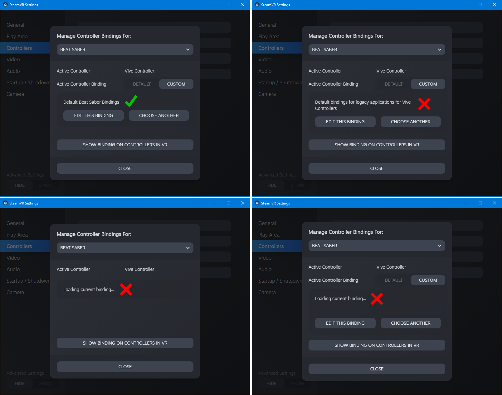
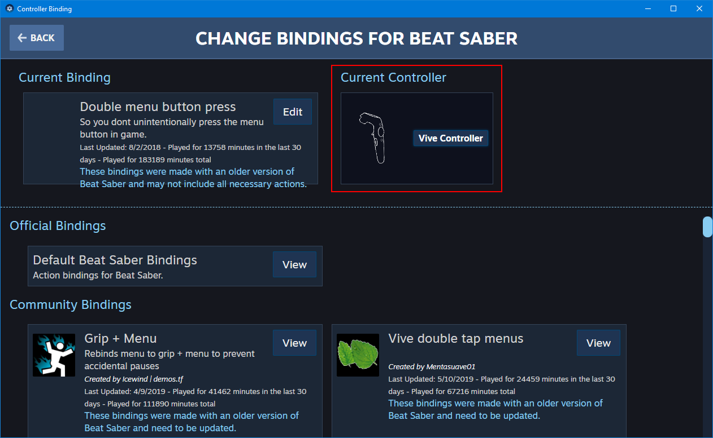
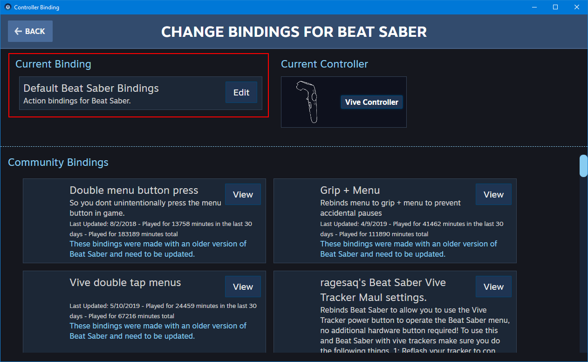
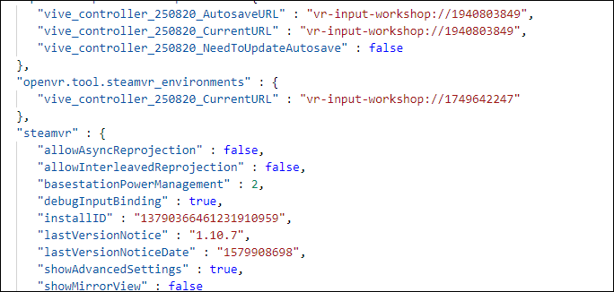
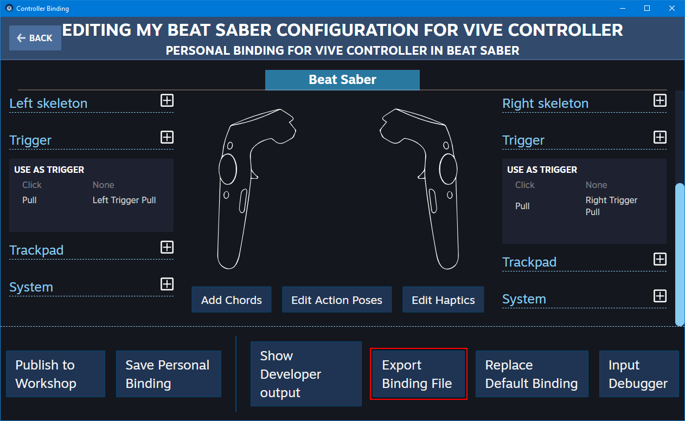

# Table of Contents

If anything in this guide is unclear, feel free to [open an issue](https://github.com/nicoco007/DynamicOpenVR/issues).

- [Table of Contents](#table-of-contents)
- [Checking the installation](#checking-the-installation)
- [Buttons and/or tracking aren't working properly](#buttons-andor-tracking-arent-working-properly)
  - [Diagnosing issues with bindings](#diagnosing-issues-with-bindings)
  - [Selecting a default binding](#selecting-a-default-binding)
  - [Creating a new binding for your controllers](#creating-a-new-binding-for-your-controllers)
  - [Getting to the binding editor when the Edit this Binding button is not visible](#getting-to-the-binding-editor-when-the-edit-this-binding-button-is-not-visible)
  - [Deleting the current binding](#deleting-the-current-binding)
  - [Restore missing buttons in the bindings UI](#restore-missing-buttons-in-the-bindings-ui)
  - [Exporting bindings so they can be included by default in DynamicOpenVR](#exporting-bindings-so-they-can-be-included-by-default-in-dynamicopenvr)
  - [Running without DynamicOpenVR](#running-without-dynamicopenvr)
- [Sabers/hands disappear when brought up to the face](#sabershands-disappear-when-brought-up-to-the-face)
- [Completely Removing DynamicOpenVR](#completely-removing-dynamicopenvr)

# Checking the installation
Before trying anything below, please make sure all the files listed below are present in your Beat Saber installation folder (indentation indicates the contents of a folder). If you do not have file extensions visible in Windows Explorer, you will not see the `.json`/`.dll`/`.vrmanifest` at the end of the files; this is not a problem.

* DynamicOpenVR
  * Actions
    * beatsaber.json
    * customavatars.json
  * Bindings
    * beatsaber_holographic_controller.json
    * beatsaber_knuckles.json
    * beatsaber_oculus_touch.json
    * beatsaber_vive_controller.json
    * customavatars_knuckles.json
* Libs
  * DynamicOpenVR.dll
* Plugins
  * DynamicOpenVR.BeatSaber.dll

If any of these files is missing, please reinstall both DynamicOpenVR and Custom Avatars. If you have successfully started the game at least once, these files should also be present in your Beat Saber installation folder:

* DynamicOpenVR
  * action_manifest.json
  * default_bindings_holographic_controllers.json
  * default_bindings_knuckles.json
  * default_bindings_oculus_touch.json
  * default_bindings_vive_controller.json
* beatsaber.vrmanifest

If any of these are missing, DynamicOpenVR did not load properly. Please [open an issue](https://github.com/nicoco007/DynamicOpenVR/issues).

# Buttons and/or tracking aren't working properly
*If this happens after uninstalling DynamicOpenVR, please see [Completely Removing DynamicOpenVR](TROUBLESHOOTING.md#completely-removing-dynamicopenvr).*

*If you have previously selected a community-created binding, **it will not work**. Please revert to the default bindings (follow the instructions below if you don't know how).*

Input or tracking not working are usually a symptom of missing or broken input bindings. Follow the instructions below to diagnose this kind of issue. Make sure you have read [Checking the installation](#checking-the-installation) before doing any of this.

## Diagnosing issues with bindings
1. Start Beat Saber.
2. Open Controller Settings by clicking on the SteamVR menu button and choosing Devices > Controller Settings.
   
   

3. Click on Controllers, then Manage Controller Bindings.
   
   

4. Make sure Beat Saber is the selected game at the top of the window, and click on Custom next to Active Controller Binding.

   

5. You should now see which binding is currently being used by Beat Saber.
   * If it is called "Default Beat Saber Bindings," your game should technically be working. Try completely closing SteamVR and starting Beat Saber again. If input still doesn't work, please [open an issue](https://github.com/nicoco007/DynamicOpenVR/issues).
   * If it is called "Default bindings for legacy applications for &lt;Your Controllers&gt;," DynamicOpenVR did not register properly. Try completely closing SteamVR, checking if all the files listed in [Checking the installation](#checking-the-installation) are present, and starting Beat Saber again. If the same binding is still there, please [open an issue](https://github.com/nicoco007/DynamicOpenVR/issues).
   * If it is stuck on "Loading current binding&hellip;," SteamVR is most likely failing to load your previous binding. See [Deleting the current binding](#deleting-the-current-binding) to fix that and restart this section from step 1.
   * If the name of the binding is anything else, it is most likely not compatible with DynamicOpenVR. You have two options:
     * If you own controllers that are supported by default (i.e. Vive Wands, Index Controllers, Oculus Touch Controllers, or WMR Holographic Controllers), there should already be compatible bindings included with DynamicOpenVR. See [Selecting a default binding](#selecting-a-default-binding) to select the right binding. If that doesn't work, please [open an issue](https://github.com/nicoco007/DynamicOpenVR/issues).
     * If you have a different setup, see [Creating a new binding for your controllers](#creating-a-new-binding-for-your-controllers).

   See the screenshots below for reference.

   

## Selecting a default binding

1. In the Manage Controller Bindings popup, press "Choose Another." If you cannot see it, follow the instructions under [Getting to the binding editor when the Edit this binding button is not visible](#getting-to-the-binding-editor-when-the-edit-this-binding-button-is-not-visible) and continue with step 2 of this section.

   

2. Make sure the controllers you are currently using are selected.

   

3. In the window that opens, should should see a section called "Official Bindings" and "Default Beat Saber Bindings" under it. Press the "View" button.

   

4. Press the "Select this Binding" button.

   

5. You should now have the default binding selected. Try starting the game again to check if the issue is still present.

   

## Creating a new binding for your controllers

1. In the Manage Controller Bindings popup, press "Choose Another." If you cannot see it, follow the instructions under [Getting to the binding editor when the Edit this binding button is not visible](#getting-to-the-binding-editor-when-the-edit-this-binding-button-is-not-visible) and continue with step 2 of this section.

   

1. Make sure the controllers you are currently using are selected.

   

2. Scroll all the way down until you see the "Create New Binding" button and press it.

   

3. You should now see the screen below. You should see all 3 buttons highlighted below. If you only see the "Add Chords" button (or if any of the buttons are missing), see [Restore missing buttons in the bindings UI](#restore-missing-buttons-in-the-bindings-UI).

    

4.  Start configuring the binding. Start with buttons and triggers.
    * "Menu Button" &rarr; Menu Click
    * "Left Trigger Pull" &rarr; Left Trigger Pull
    * "Right Trigger Pull" &rarr; Right Trigger Pull

    Below is an example of adding the Left Trigger Pull action.

    1. Press the "+" button next to the input to which you want to bind an action. For this example, we will add the action to the left trigger.

        

    2. Next, select the mode in which the input will be used. Since we want to use the trigger as, well, a trigger, select "Trigger." If no actions show up when configuring an input, it is most likely because there is a file missing. Please read [Checking the installation](#checking-the-installation) to make sure no files are missing and try again. If you are still having problems, please [open an issue](https://github.com/nicoco007/DynamicOpenVR/issues).

       

    3. Select the value to be used for the action. Since we want the trigger's value between 0 and 1, select "Pull."

       

    4. Finally, select the action to bind to the value. Since this is the left hand trigger, select "Left Trigger Pull."

       
    
    Repeat these steps for the right trigger and the menu button. Note that for the menu button, you should be choosing "Button" as the mode and "Click" as the value to be used.

5.  Once you are done adding the button bindings, your screen should look like this.

    

6.  After you've done the buttons, add the following action poses by pressing the "Edit Action Poses" button.

    * "Left Hand Pose" &rarr; Left Hand Raw
    * "Right Hand Pose" &rarr; Right Hand Raw

    

7.  Finally, you can add the haptics.
    
    * "Left Slice Haptic Feedback" &rarr; "Left Hand Haptics"
    * "Right Slice Haptic Feedback" &rarr; "Right Hand Haptics"

    

8.  Once you are done, you can save your bindings by pressing "Save Personal Binding" at the bottom of the screen, entering a name and a description, and pressing the "Save" button. Note that it may take a few seconds for the binding to save and for the popup to close (don't press cancel!).

    

9.  And there you go! Your bindings are now configured and you should be able to use in-game input properly. You can now close the settings windows and enjoy your game! If you would like to submit the bindings you just created to be included by default in DynamicOpenVR, see [Exporting bindings so they can be included by default in DynamicOpenVR](#exporting-bindings-so-they-can-be-included-by-default-in-dynamicopenvr).

    If, however, you are still having input issues after doing all of this, you can try running without DynamicOpenVR input by following the instructions under [Running without DynamicOpenVR](#running-without-dynamicopenvr).

    

## Getting to the binding editor when the Edit this Binding button is not visible

1. Close the binding management popup and click "Show" under "Advanced Settings" in the bottom left corner. You should now see the "Show Old Binding UI" button; press it.

   

2. In the window that opens, select "Beat Saber." Since you have the game open, it should be at the top of the list.

   

3. You should now see the window below. Make sure the right game is selected by looking at the window's header; it should be "Change Bindings for Beat Saber." If you have not selected the right game, press the "Back" button and choose the right one.

   

## Deleting the current binding

1. Close SteamVR.
2. Go to your Steam installation folder (usually `C:\Program Files (x86)\Steam`).
3. Go to the `config` folder.
4. There will be a filed called `steamvr.vrsettings`. Open it in a text editor (e.g. Notepad).
5. Scroll down until you see the line `"steam.app.620980 : {`.

   

6. Remove the section highlighted above, starting from the `"steam.app.620980" : {` line all the way down and including the `},`. The file should now look like this:

   

7. Start SteamVR again.

## Restore missing buttons in the bindings UI

1.  Press the back button in the top right corner and select one of the following controllers:
    * Index Controller
    * Oculus Touch
    * Vive Controller
   
    You **must** choose one of the above controllers because they come with default bindings. For this guide, we will choose the Index Controller.

    

2.  Press the "Edit" button under "Current Binding."

    

3.  Press the back button without editing anything.

    

4. Restart [Creating a new binding for your controllers](#creating-a-new-binding-for-your-controllers) at step 1.

## Exporting bindings so they can be included by default in DynamicOpenVR

1. Open Controller Settings and make sure Advanced Settings are set to show (see above if necessary). Select "Developer" in the left-hand pane, turn "Enable debugging options in the input binding user interface" to ON, and press the "Restart SteamVR" button that appears afterwards.

    

2. After SteamVR has restarted, go once again to Controller Settings, select Controllers, press "Manage Controller Bindings."

   

3. Make sure Beat Saber is selected, press "Custom," and press "Edit Binding."

   

4. You should now once again see your binding. Press the "Export Binding File" that has appeared at the bottom of the screen.

    

5. A new file whose name starts with `export_steam.app.620980_` followed by your controller name and the name of the binding should have been created your Documents folder under `steamvr\input\exports` (usually `C:\Users\<Your Name>\Documents\steamvr\input\exports`). Compress that file into a ZIP, attach it to a [new issue](https://github.com/nicoco007/DynamicOpenVR/issues) (GitHub unfortunately does not allow attaching JSON files directly), and you're good to go!

   
   
   
## Running without DynamicOpenVR
If you were not able to solve your input issues with the instructions above, you can try running Beat Saber without DynamicOpenVR. To do so, simply stop the game, delete the `Plugins\DynamicOpenVR.BeatSaber.dll` file, and start the game once again. Everything else should load as expected. If not, please [open an issue](https://github.com/nicoco007/DynamicOpenVR/issues).

# Sabers/hands disappear when brought up to the face

After running the game at least once, there should be a file called `CustomAvatars.json` in the `UserData` folder inside Beat Saber's installation folder (usually `C:\Program Files (x86)\Steam\steamapps\common\Beat Saber` for Steam). Open that file in any text editor (e.g. Notepad) and change the number beside `cameraNearClipPlane` to anything down to 0.01. A smaller number means stuff will be visible closer to your eyes but may affect performance negatively.

# Completely Removing DynamicOpenVR
DynamicOpenVR generates files specific to your computer to improve user experience in SteamVR's interface. These files may cause issues after partially removing DynamicOpenVR. To completely uninstall DynamicOpenVR, first close SteamVR, then make sure these files/folders no longer exist in Beat Saber's installation folder:

* Libs\DynamicOpenVR.dll
* Plugins\DynamicOpenVR.BeatSaber.dll
* DynamicOpenVR (the entire folder)
* beatsaber.vrmanifest

If, after deleting all these files, your controllers are unresponsive, you may have to delete the current binding manually since SteamVR is confused. Follow the instructions in [Deleting the current binding](#deleting-the-current-binding) to get rid of it.

If you're still having issues after following all of these steps, please [open an issue](https://github.com/nicoco007/DynamicOpenVR/issues). If you don't want to wait, the only sure-fire way of getting the game to work again is to do a clean install. It is highly recommended to make a backup of the installation folder before reinstalling the game if you want to keep your songs/avatars/sabers/settings or any other stuff that might be in there.
